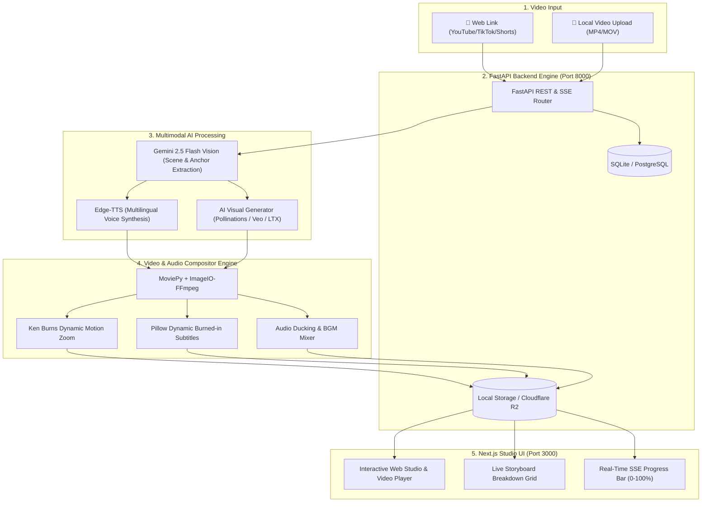

# Animaker AI - Video-to-Animation Remake Studio 🎬✨

An end-to-end autonomous **AI Video-to-Animation Remake Studio**. Provide any video link (YouTube, TikTok, Shorts, Facebook Reels) or upload a local video file (`.mp4`, `.mov`, `.mkv`), and the system watches and understands the narrative scene-by-scene with **Gemini 2.5 Flash Multimodal Vision**, extracts character anchors for visual consistency, synthesizes narrations in 70+ languages via **Edge-TTS**, generates stylized animation scenes with **Veo / Pollinations / LTX**, overlays **burned-in subtitles & background music**, and stitches everything into a high-quality animation remake video.

---

## 🌟 Key Features (အဓိက အထူးပြု အင်္ဂါရပ်များ)

* **📁 Dual Ingestion (Link + Local File Upload):**
  * Paste links from YouTube, TikTok, Shorts, Facebook, Instagram via `yt-dlp`.
  * Direct Drag & Drop local video file upload (`.mp4`, `.mov`, `.mkv`, `.webm`, `.avi`) via `POST /api/jobs/upload`.
* **🧠 Gemini 2.5 Flash Multimodal Video Understanding:**
  * Analyzes full-length video frames, audio, narrative pacing, and dialogue.
  * Breaks down the story into structured scenes with cinematic lighting, camera angles, and art prompts.
* **🎭 Character & Setting Visual Consistency Anchoring:**
  * Locks character facial features, hair, wardrobe, and atmosphere to maintain identical character identity across all scenes.
* **🌐 Multilingual Voiceover Engine (70+ Languages):**
  * High-fidelity neural voice synthesis (Burmese Thiha/Nilar, English, Japanese, Korean, Thai, Chinese, Spanish, French, etc.) via `edge-tts`.
* **🎨 Multi-Tier AI Visual Generation:**
  * **Free Instant Tier:** Pollinations AI (Zero API key needed, unlimited free generation with auto-retry resilience).
  * **Cinematic Video Tier:** Google Veo 3.1 & LTX-Video.
* **📝 Burned-In Subtitles (Captions Overlay):**
  * Dynamic, high-contrast, rounded dark-pill subtitles composited over video frames.
* **🎵 Background Music (BGM) & Audio Ducking:**
  * Built-in ambient tracks (*Cinematic Ambient*, *Playful Lo-Fi*, *Deep Storyteller*) with automatic audio volume ducking during voiceover narration.
* **⚡ Zero-Config One-Click Windows Launchers:**
  * `start.bat` for universal auto-launching with environment checks and auto browser opening.
  * `stop.bat` for one-click clean shutdown of all background services.
* **📡 Real-Time Live Streaming:**
  * Server-Sent Events (SSE) streaming live 0–100% progress updates to the interactive Next.js studio UI.

---

## 🏗️ System Architecture (စနစ်၏ တည်ဆောက်ပုံ)



---

## ⚡ Quick Start Guide (စတင် အသုံးပြုနည်း)

### Method 1: One-Click Windows Launcher (Windows စက်များအတွက်)

1. Make sure your `GEMINI_API_KEY` is configured in the `.env` file (Get a free key from [Google AI Studio](https://aistudio.google.com/)).
2. **Double-click `start.bat`**.
3. The launcher will automatically:
   * Detect Python and Node.js.
   * Create the Python virtual environment and install dependencies.
   * Start the Backend API server (Port 8000) and Frontend Studio (Port 3000).
   * Automatically open your browser at **`http://localhost:3000`**.
4. To shut down everything when done, double-click **`stop.bat`**.

---

### Method 2: Google Colab 1-Click Cloud Run (100% Free T4 GPU — ကွန်ပျူတာ အဆင့်မြင့်စရာမလိုဘဲ အသုံးပြုနည်း)

[](https://colab.research.google.com/github/paipai1999/pai-ai-animation-video/blob/main/Animaker_AI_Google_Colab.ipynb)

ကွန်ပျူတာတွင် Python / Node.js သွင်းစရာမလိုဘဲ Google Colab ၏ အခမဲ့ **T4 GPU Cloud** ကို အသုံးပြု၍ မည်သည့် စက် (PC / Mac / Phone / Tablet) မှမဆို အသုံးပြုနိုင်ပါသည်:

1. **`Animaker_AI_Google_Colab.ipynb`** ဖိုင်ကို [Google Colab](https://colab.research.google.com/) တွင် **Upload** လုပ်၍ ဖွင့်ပါ။
2. Colab ၏ **`Runtime` -> `Change runtime type`** တွင် **`T4 GPU`** ကို ရွေးချယ်ပါ။
3. **Step 1 (Install Dependencies)** နှင့် **Step 2 (Enter Gemini API Key)** တို့ကို အစဉ်လိုက် Run ပါ။
4. **Step 3 (Start Studio & Launch Web UI)** ကို Run လိုက်ပါက အောက်ခြေတွင် Cloudflare Public Link (ဥပမာ `https://xxxx.trycloudflare.com`) ပေါ်လာမည်ဖြစ်ပြီး ထို Link ကို နှိပ်၍ Studio Web UI ကို မည်သည့် Browser တွင်မဆို တိုက်ရိုက် အသုံးပြုနိုင်ပါပြီ!

---


### Method 3: Docker Compose (Docker ဖြင့် အသုံးပြုလိုပါက)

```bash
# 1. Double click start_docker.bat OR run:
docker-compose up --build -d

# 2. Start Frontend Web
cd frontend
npm run dev
```
Open **`http://localhost:3000`** in your browser.

---

### Method 4: Manual Developer Setup (Developer များအတွက်)


#### (A) Backend Setup
```bash
# 1. Create and activate Python virtual environment
cd backend
python -m venv venv

# Windows:
venv\Scripts\activate
# Linux/Mac:
source venv/bin/activate

# 2. Install dependencies
pip install -r requirements.txt

# 3. Start Backend Server
cd ..
set PYTHONPATH=.
python -m uvicorn backend.app.main:app --host 0.0.0.0 --port 8000 --reload
```

#### (B) Frontend Setup
```bash
# In a new terminal:
cd frontend
npm install
npm run dev
```

---

## 📡 API Endpoints Reference

| Method | Endpoint | Description |
| :--- | :--- | :--- |
| `GET` | `/api/health` | System health check and Gemini API status |
| `GET` | `/api/styles/` | Available styles, languages, voices, BGM tracks & engines |
| `POST` | `/api/jobs/` | Create a new remake job from URL (JSON payload) |
| `POST` | `/api/jobs/upload` | Create a remake job from uploaded video file (Multipart) |
| `GET` | `/api/jobs/` | List all recent remake jobs |
| `GET` | `/api/jobs/{id}` | Get detailed job status, final video URL, and storyboard |
| `GET` | `/api/jobs/{id}/progress` | Real-time Server-Sent Events (SSE) progress stream |
| `DELETE` | `/api/jobs/{id}` | Delete a job record and associated assets |

---

## 🎨 Supported Animation Styles

* 🏰 **3D Pixar / Disney Style** — Vibrant, highly expressive stylized 3D animation.
* 🌸 **Japanese Anime / Studio Ghibli** — Hand-drawn aesthetic with lush watercolor backgrounds.
* 🕷️ **Spider-Verse Comic Book** — Halftone dots, chromatic aberration, graphic novel aesthetic.
* 🤖 **Cyberpunk Sci-Fi Anime** — Neon-lit futurism, volumetric fog, dynamic lighting.
* 🧶 **Claymation Stop-Motion** — Tactile clay textures, handcrafted stop-motion aesthetic.

---

## 🇲🇲 မြန်မာဘာသာဖြင့် အသုံးပြုပုံ ညွှန်ကြားချက်

1. **API Key ထည့်သွင်းခြင်း:** `.env` ဖိုင်ထဲတွင် Google AI Studio မှ ရရှိသော `GEMINI_API_KEY` ကို ထည့်သွင်းထားပါ။
2. **စနစ်ဖွင့်ရန်:** Project Folder ထဲရှိ **`start.bat`** ကို **Double Click** နှိပ်လိုက်ရုံဖြင့် လိုအပ်သော Setup များကို အလိုအလျောက် ဆောင်ရွက်ပြီး Browser တွင် **`http://localhost:3000`** အလိုအလျောက် ပွင့်လာပါမည်။
3. **ဗီဒီယို ပြောင်းလဲရန်:**
   * YouTube / TikTok / Shorts Link ကို Paste ထည့်ပါ (သို့မဟုတ်) မိမိစက်ထဲရှိ MP4 ဖိုင်ကို Drag & Drop ဆွဲထည့်ပါ။
   * မိမိနှစ်သက်ရာ **Animation Style** (3D Pixar, Anime, Comic စသည်) ကို ရွေးချယ်ပါ။
   * **Audio Language** တွင် *မြန်မာစာ (Burmese)* သို့မဟုတ် နှစ်သက်ရာ ဘာသာစကားကို ရွေးချယ်ပါ။
   * **Background Music** (Cinematic, Lo-Fi, Ambient) နှင့် **Subtitles** ကို စိတ်ကြိုက် သတ်မှတ်ပါ။
   * **"Generate Animated Remake"** ခလုတ်ကို နှိပ်လိုက်သည်နှင့် စနစ်က အသံထွက်၊ စာတန်းထိုး ပါဝင်သော ကာတွန်းဗီဒီယို အစအဆုံး အလိုအလျောက် ထုတ်လုပ်ပေးမည် ဖြစ်ပါသည်။
4. **စနစ်ပိတ်ရန်:** အသုံးပြုပြီးပါက **`stop.bat`** ကို Double Click နှိပ်၍ ပိတ်နိုင်ပါသည်။

---

## 📄 License
This project is licensed under the MIT License.
